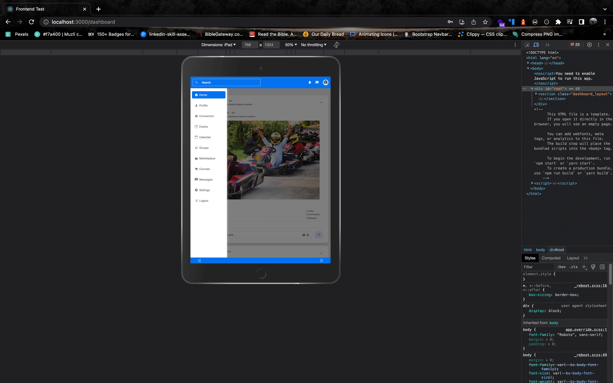
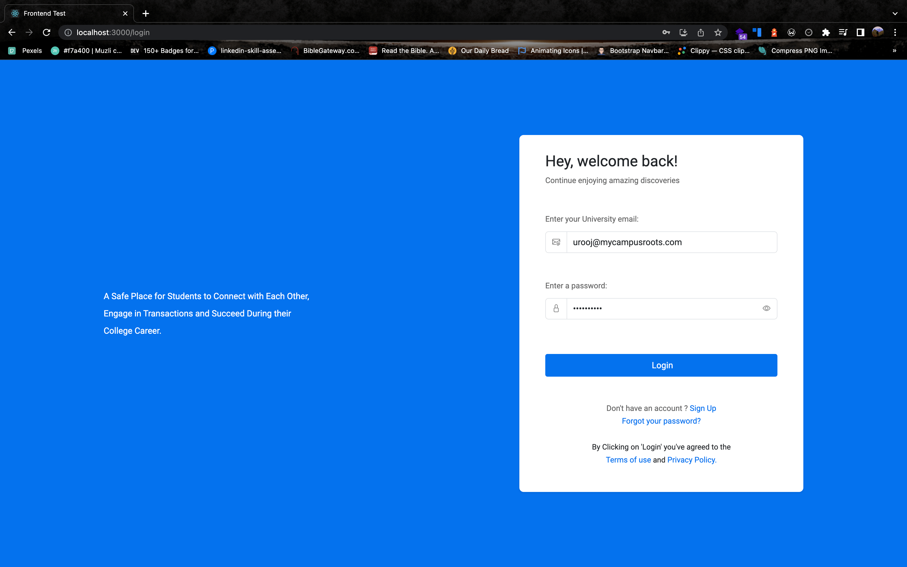
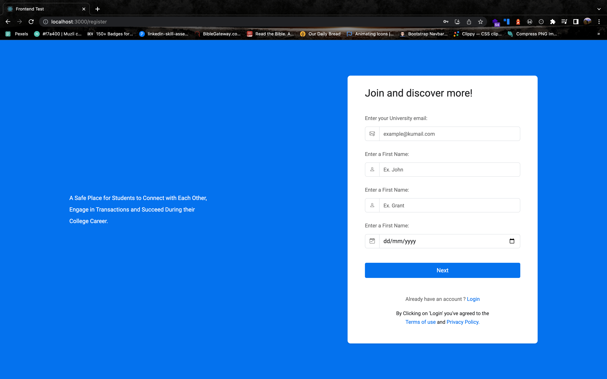
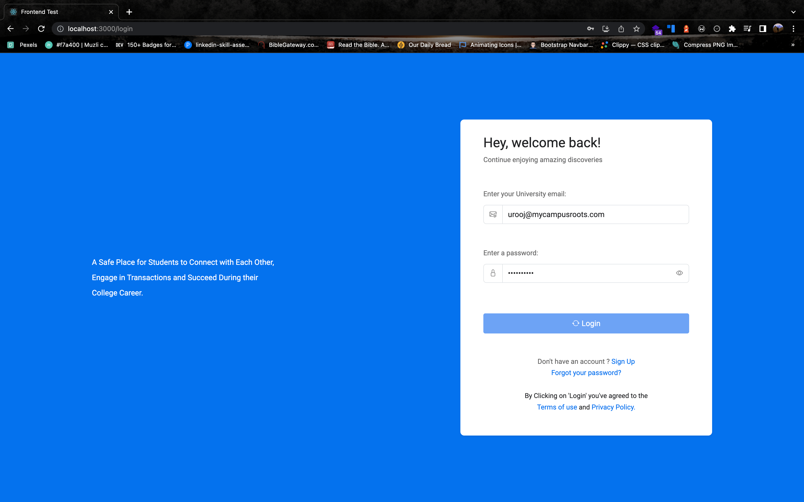
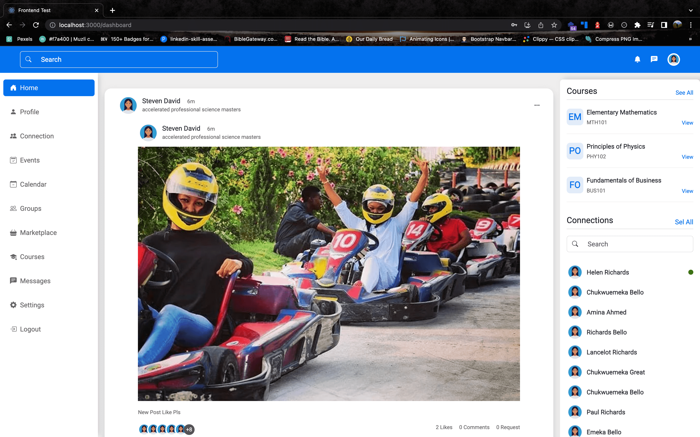
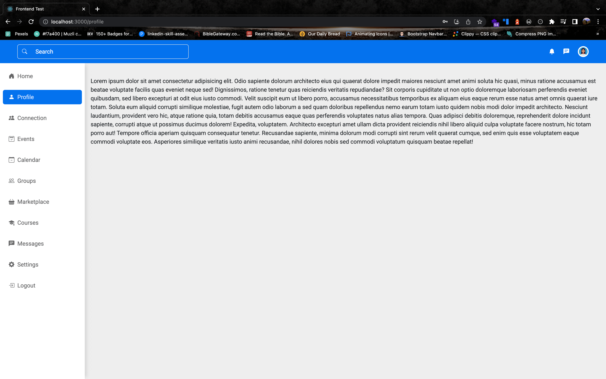
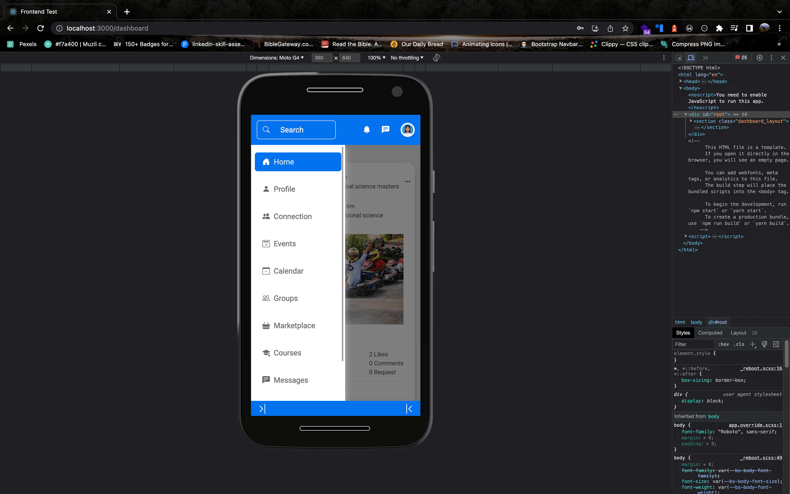
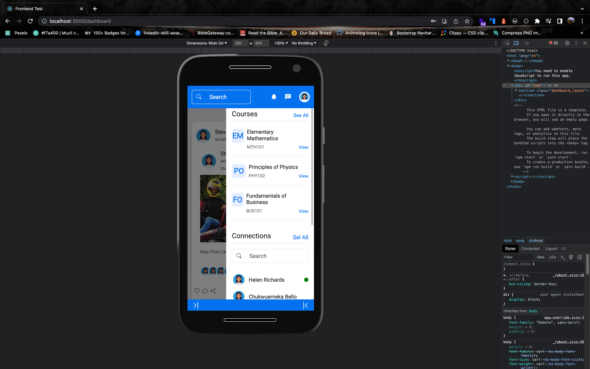

# Installation Steps

This project was created with [Create React App]

NB: I used cors-anywhere to bypass CORS issue. This is not a good practice for production. I would have used a proxy server to handle this, but for the sake of time, I used cors-anywhere.

```
Node 16
Yarn 1.22.19
```

## Install dependencies

```
yarn || yarn install
```

## Run the app

```
yarn start
```

### Screenshots








